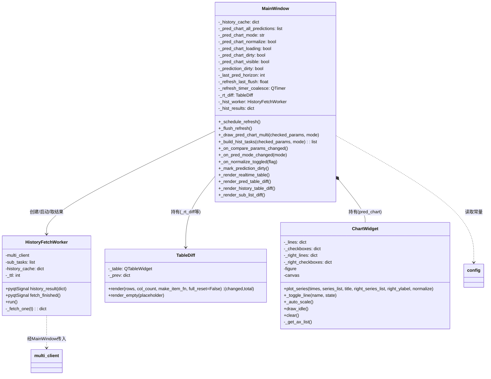
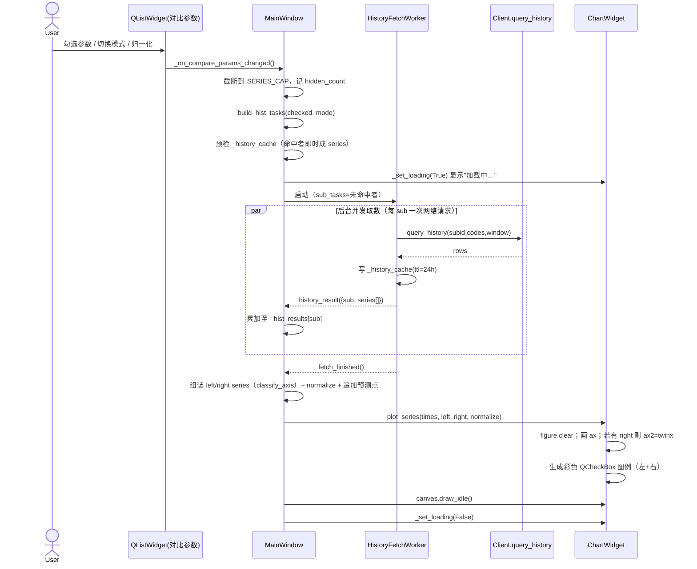
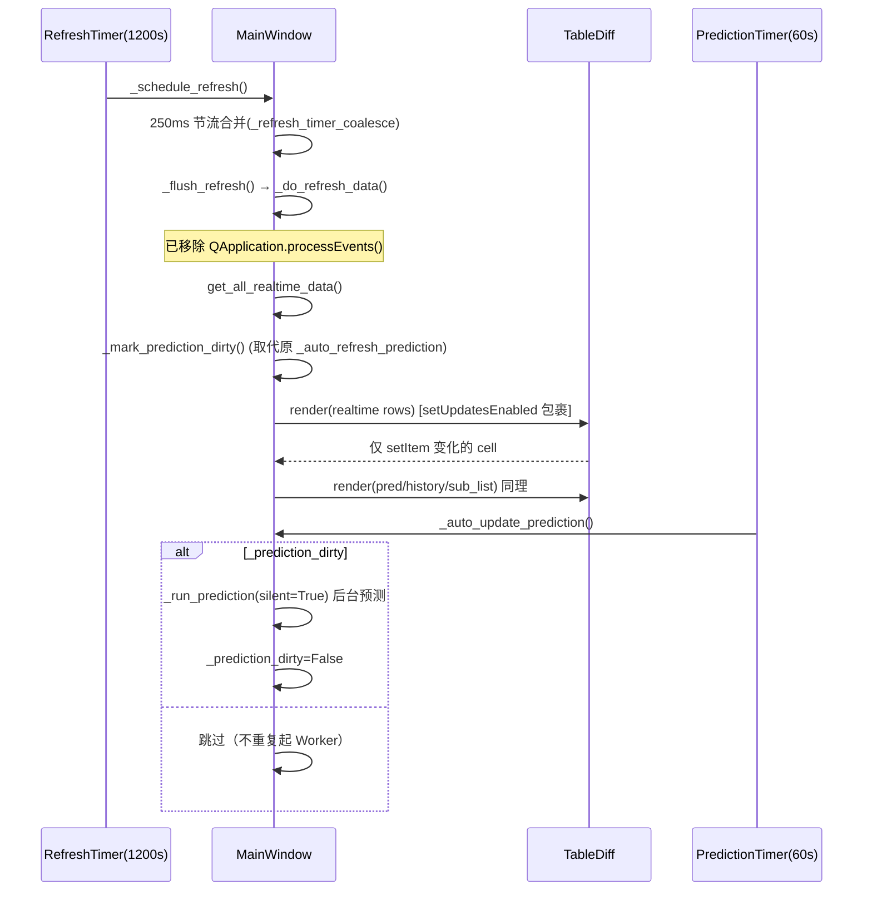
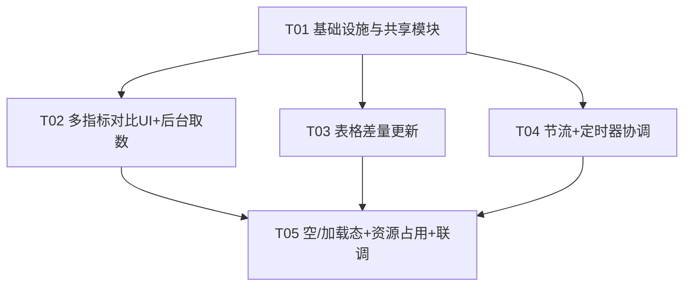

# GZ_Monitor 三项核心优化 — 架构设计 + 任务分解

> 版本: v1.0 ｜ 架构师: Bob ｜ 输入: Alice 的 PRD（三项优化）＋ 代码探索
> 代码基线: `src/main_window.py`（v5.18.1，~11,500 行）、`src/chart_widget.py`、`src/multi_account_api.py`、`src/config.py`
> 技术栈: Python 3 + PyQt5 + matplotlib(Qt5Agg)，Windows 7 兼容。**不引入任何新重型依赖。**

---

## 一、现状摘要（探索结论，关键行号）

| 痛点 | 根因（代码位置） | 结论 |
|------|----------------|------|
| 切指标卡顿（P1） | `_draw_pred_chart_for_param` 在**主线程**对每个排口同步 `client.query_history()`（L4700），再 `pred_chart.plot_series()` → `canvas.draw()`（chart_widget.py:389） | 网络 I/O + 同步重绘都在主线程 |
| 实时表卡顿（P2） | `realtime_table` 每次 `setRowCount` + 每格 `setItem`（L2765–2899），无差量、无 `setUpdatesEnabled` | 全量重写 ~30×7=210 次 setItem |
| 阻塞调用（P3） | `_do_refresh_data` 内 `QApplication.processEvents()`（L2454）；另 L660 在账户登录同步循环中 | L2454 可安全移除；L660 需谨慎 |
| 预测被重复触发 | `_do_refresh_data` L2493 调 `_auto_refresh_prediction()` → 每次刷新都起一个完整 `PredictionWorker`；叠加 `prediction_timer`(1min) 又起一个 | 预测实际每刷新周期被触发 2 次，是隐藏的性能黑洞 |
| 单选取数（问题一） | `pred_chart_param_combo` 单选 `QComboBox`（L1928）连 `_on_pred_chart_param_changed`（L1949） | 需改为多选叠加 |
| 缺双 Y 轴 | `ChartWidget.plot_series` 仅单轴（chart_widget.py:293） | 需扩展 twinx + normalize |
| 缺节流/差量 | 无；`pred_table` 列重建每次都跑（L4353） | 需补充 |

**复用的现有能力**：
- `PredictionWorker(QThread)`（L73）：`prediction_done = pyqtSignal(list)`，通过**共享 dict**（`_api_data_cache`/`_sub_itemcodes_cache`）跨线程缓存，内部 `_get_cached(key, ttl, fetch_fn)` 模式 —— `HistoryFetchWorker` 直接复用此模式。
- `ChartWidget` 已支持：多 series + 每条曲线彩色 `QCheckBox` 图例显隐（`_toggle_line`）、`_auto_scale`、`draw_idle`、空状态"暂无数据"占位。
- `multi_client.query_history(subid, subtype, codes, start, end, index, page, rows, use_corrected)`（multi_account_api.py:200）可直接被 worker 调用（经 `get_client_by_subid` 取 client）。
- `config.py` 已有 `COLORS`、`WASTEWATER_PARAMS`/`WASTE_GAS_PARAMS`（含 pH值/水温/烟气温度 名称），适合放可调常量。

---

## 二、Part A 系统设计

### 1. 实现方案

**技术难点**
1. 历史取数（网络 I/O）移出主线程且不破坏现有"按需预测 + 预测点叠加"逻辑。
2. 差量更新需在"参数集合变化（换排口）"与"同集合数值刷新"两种场景间正确降级。
3. 双 Y 轴 + 归一化 + 多 series 图例显隐的共存（hover 需跨双轴）。

**框架 / 库选型**
- 保持 **PyQt5 + matplotlib(Qt5Agg)**，零新增第三方依赖。
- 新增两个轻量自有模块：`history_fetch_worker.py`（后台取数线程）、`refresh_utils.py`（差量引擎/节流/轴分类/空态）。二者均为标准库级纯 Python + PyQt5，Windows 7 兼容。
- 可调参数集中到 `config.py`（FIG_DPI / SERIES_CAP / HISTORY_TTL / THROTTLE_MS / RIGHT_AXIS_PARAMS）。

**架构模式**：事件驱动 + 后台 Worker（QThread + pyqtSignal）回主线程，主线程只做"数据组装 + `draw_idle()`"。表格采用"快照差量"渲染（命令式，不升级 QTableView/Model，控制风险）。

### 2. 文件列表（相对 `src/`）

| 文件 | 动作 | 说明 |
|------|------|------|
| `history_fetch_worker.py` | **新增** | `HistoryFetchWorker(QThread)`：后台按 sub 批量取历史，缓存感知，逐 sub 发 `history_result`，结束发 `fetch_finished` |
| `refresh_utils.py` | **新增** | `TableDiff`（差量渲染引擎）、`classify_axis()`（左/右轴分类）、`THROTTLE` 辅助 |
| `chart_widget.py` | 修改 | `plot_series` 扩展 `right_series_list`/`right_ylabel`/`normalize`；新增 `_right_lines`/`_right_checkboxes`；`_toggle_line`/`_auto_scale` 覆盖双轴；figure dpi/size 下调；hover 跨轴 |
| `config.py` | 修改 | 追加 `FIG_DPI=80`、`SERIES_CAP=12`、`HISTORY_TTL=86400`、`THROTTLE_MS=250`、`HISTORY_INDEX=1`、`RIGHT_AXIS_PARAMS={"pH值","烟气温度","水温"}`、`EMPTY_PLACEHOLDER="暂无数据"` |
| `main_window.py` | 修改 | ① 状态初始化（缓存/脏标记/节流/差量器）；② 移除 L2454、安全处理 L660；③ 用可勾选 `QListWidget` 面板替换 `pred_chart_param_combo`；④ 新增 `_draw_pred_chart_multi` / `_build_hist_tasks` / 模式与归一化切换；⑤ 表格差量渲染；⑥ 节流 `_schedule_refresh` + 预测脏标记；⑦ 空/加载态 + 24h 历史缓存接线 |
| `multi_account_api.py` | 不变 | `query_history` 已满足需求，由 worker 直接调用 |

> 说明：因 `main_window.py` 为单体大文件，任务分解中"文件"按**逻辑模块（方法组）**对应到上述文件，工程师按方法名定位。

### 3. 数据结构与接口（类图）

> 完整 Mermaid 另存于 [`class-diagram.mermaid`](./class-diagram.mermaid)。



**关键接口契约**
- `HistoryFetchWorker.sub_tasks` 元素结构：
  `{subid, subtype_code, codes, params:[(code,name,axis)...], start, end, index, use_corrected}`
  —— **按 sub 聚合**（一次网络请求取全量 codes，本地拆分多参数），避免 N 参数 = N 次请求。
- `history_result` payload：`{subid, subname, ent_name, subtype_code, window, series:[{param_name,code,axis,times,values}]}`
- `TableDiff.render(rows, col_count, make_item_fn, full_reset=False)`：
  - `rows`：渲染后的二维值（与列数一致的内容）。
  - `make_item_fn(r,c,val)` → `QTableWidgetItem`（含文字+前景色）。
  - 内部用签名 `sig=(item.text(), item.foreground().color().name())` 做差量比对，`(row,col)` 为键。
  - `full_reset=True` 或形状（行/列数）变化 → 全量 `setItem` 并重置快照。
- `ChartWidget.plot_series(times, series_list, title="", right_series_list=None, right_ylabel="", normalize=False)`：
  - `series_list` / `right_series_list` 元素：`{name, data, times?}`，`name` 即为图例（彩色 `QCheckBox`）。
  - `normalize=True`：所有 series 按各自 min-max 映射到 [0,1]，强制单轴。

### 4. 程序调用流程（时序图）

> 完整 Mermaid 另存于 [`sequence-diagram.mermaid`](./sequence-diagram.mermaid)。

**流程一：勾选多参数 → 后台取数 → draw_idle（问题一 + P1）**



**流程二：刷新定时器 → 差量更新 + 预测脏标记（P2/P3/P4/P5/P6）**



### 5. 待明确事项（6 个待确认问题的决策 + 额外）

**已按推荐默认推进的决策（写入设计，工程师按此实现）：**

1. **曲线上限**：`SERIES_CAP = 12`（默认 8–12 取上限）。超限时保留前 N 条、自动隐藏多余，标题/标签显示"已隐藏 X 条"，**不禁止勾选**。
2. **对比模式默认**：`同排口多参数`（`_pred_chart_mode` 初始值）。
3. **量纲**：默认**双 Y 轴**（左=浓度 mg/L，右=twinx 承载 pH/温度）；提供「归一化」按钮切换。
4. **表格方案**：采用**差量更新**，**不升级** QTableView+Model（控制改造量与风险）。
5. **刷新频率**：沿用 `refresh_interval = 1200s`，本次不调整。
6. **历史缓存**：本地缓存 **24h**，key = `(subid, subtype_code, codes, start, end, index, use_corrected)`。

**模式语义的设计裁定（PRD F3 略有歧义，明确如下）：**
- 可勾选面板**始终列出"参数"**（同 PRD"对比参数"）。
- `同排口多参数`：勾选参数 × **当前选中排口**（`self.selected_subid`，无选中则取首个可见排口）→ `param@sub`。
- `同参数多排口`：勾选参数 × **所有可见排口** → 每条 `param@sub`（外层排口、内层参数；单参数勾选时即"同参数跨排口"；多参数时取叉积，由 SERIES_CAP 截断）。轴归属跟随参数（pH/温度→右轴）。

**仍需用户拍板 / 注意的点：**
- **L660 的 `QApplication.processEvents()`** 位于**账户登录同步循环**内（用于刷新"登录中…"状态）。直接删除会让登录期间 UI 不刷新进度。**本次默认：保留 L660 不动**，仅在 `_do_refresh_data` 移除 L2454；若要坚持 P3 全移除，需把登录改为后台线程（超出本次范围，建议作为后续项）。已在 T04 标注为"评估项"。
- **多企业标签消歧**：`参数@排口` 在跨企业同名排口时可能重复，默认 `label = f"{param}@{subname}"`，多企业时升级为 `f"{param}@{ent_name}-{subname}"`（由 `classify_axis`/组装逻辑按 `current_grouped_data` 企业数决定）。
- **归一化与双轴互斥**：开启归一化时强制单轴（0–1），忽略右轴与 twinx。
- **hover 跨双轴**：保留显示两条轴上所有可见线的 tooltip（已在 ChartWidget 改动中处理）。
- **"预测点"叠加**：沿用现有逻辑——每个 series 尾部追加该 (ent,sub,param) 的预测值 + "预测"时间标签。
- **Windows 7 兼容**：仅用标准 PyQt5 控件（`QListWidget` + `ItemIsUserCheckable`）与 matplotlib，无新依赖，安全。

---

## 三、Part B 任务分解

### 6. 依赖包（基本无新增）

```
- PyQt5            # 已有：UI 框架（QListWidget / QTimer / QThread / pyqtSignal）
- matplotlib       # 已有：Qt5Agg 后端绘图（draw_idle / twinx）
- （标准库）time / datetime / functools  # 节流、缓存 TTL、时间窗
```
> 结论：**无新增第三方依赖**；新增 `history_fetch_worker.py`、`refresh_utils.py` 为项目内自研轻模块。

### 7. 任务列表（有序、含依赖、按实现顺序）

> 共 5 个任务（≤5 上限），每个任务 ≥3 个相关文件；T02/T03/T04 仅依赖 T01，T05 为集成收尾。

#### T01 — 基础设施与共享模块（项目基础设施）【P0】
- **Source Files**：`src/config.py`、`src/refresh_utils.py`(新)、`src/history_fetch_worker.py`(新)、`src/chart_widget.py`、`src/main_window.py`
- **Dependencies**：无
- **Priority**：P0
- **做什么**：
  1. `config.py`：追加 `FIG_DPI=80`、`SERIES_CAP=12`、`HISTORY_TTL=86400`、`THROTTLE_MS=250`、`HISTORY_INDEX=1`、`RIGHT_AXIS_PARAMS={"pH值","烟气温度","水温"}`、`EMPTY_PLACEHOLDER="暂无数据"`。
  2. `refresh_utils.py`：实现 `TableDiff`（见 §3 契约）、`classify_axis(param_name)->"left"|"right"`、`make_throttle` 辅助。
  3. `history_fetch_worker.py`：实现 `HistoryFetchWorker(QThread)`，`run()` 按 sub 调 `client.query_history`、写 `_history_cache`、发 `history_result`/`fetch_finished`；内置 `_get_cached(key,ttl,fetch_fn)` 复刻 `PredictionWorker` 缓存模式。
  4. `chart_widget.py`：`plot_series` 增加 `right_series_list/right_ylabel/normalize`；新增 `_right_lines/_right_checkboxes`；`_toggle_line`/`_auto_scale` 覆盖双轴；figure 改用 `dpi=FIG_DPI`、figsize 略缩；`HoverFigureCanvas` 改为遍历所有 axes 的可见线。
  5. `main_window.py`：`__init__` 新增状态 `_history_cache={}`、`_pred_chart_mode/_pred_chart_normalize/_pred_chart_loading/_pred_chart_dirty/_pred_chart_visible/_prediction_dirty`、`_last_pred_horizon=-1`、`_refresh_last_flush=0`、`_refresh_timer_coalesce=None`、`_rt_diff=TableDiff(self.realtime_table)`、`_hist_worker=None`、`_hist_results={}`；**删除 L2454 的 `QApplication.processEvents()`**；将 `refresh_timer.timeout` 目标改为 `self._schedule_refresh`。

#### T02 — 多指标对比 UI + 后台取数【问题一 + P1】【P0】
- **Source Files**：`src/main_window.py`、`src/history_fetch_worker.py`、`src/chart_widget.py`
- **Dependencies**：T01
- **Priority**：P0
- **做什么**：
  1. 删除 `pred_chart_param_combo` 创建（L1928–1949）及其全部引用（L4608–4622、4626–4628、4824）。
  2. 在预测图标题栏下方新增：可勾选 `QListWidget`（横向滚动、`maxHeight≈40`、`ItemIsUserCheckable`）+「全选/反选/清空」按钮 + 模式开关（同排口多参数/同参数多排口）+「归一化」按钮。
  3. 新增 `_build_hist_tasks(checked_params, mode)`：按 §5 裁定生成 `sub_tasks`（按 sub 聚合，含 `params:[(code,name,axis)]`）。
  4. 新增 `_draw_pred_chart_multi(checked_params, mode)`：预检 `_history_cache` 即时成 series；启动/复用 `HistoryFetchWorker`（取消上一个未完成 worker）；`history_result` 累加、`fetch_finished` 组装 left/right + 归一化 + 追加预测点 → `pred_chart.plot_series(...)` → `canvas.draw_idle()`；超限截断并提示"已隐藏 X 条"。
  5. 保留"按需预测"逻辑（`_request_on_demand_prediction` 适配多参数集合）。
  6. 模式/归一化/勾选变化 → `_on_compare_params_changed`/`_on_pred_mode_changed`/`_on_normalize_toggled` → 重算并触发取数/重绘。

#### T03 — 表格差量更新【P2 / P5 表格性能】【P0】
- **Source Files**：`src/main_window.py`、`src/refresh_utils.py`、`src/config.py`
- **Dependencies**：T01
- **Priority**：P0
- **做什么**：
  1. `realtime_table` 渲染（L2765–2899）改为：先构建二维内容 + `make_item_fn`，再 `self._rt_diff.render(...)`（内部 `setUpdatesEnabled(False/True)` 包裹、仅 `setItem` 变化 cell）；形状变化（换排口/参数集合）时 `full_reset=True`。
  2. `pred_table`（L4441）、`history_table`（L3517）、`sub_list`（L2499）同样用 `TableDiff`/包裹 `setUpdatesEnabled` 做差量或批量更新。
  3. `_rebuild_pred_table_columns`（L4353）仅在 `horizon != self._last_pred_horizon` 时执行（否则跳过），更新 `_last_pred_horizon`。
  4. 空集合时调用 `TableDiff.render_empty(EMPTY_PLACEHOLDER)` 显示单行灰色"暂无数据"占位。

#### T04 — 节流 + 定时器协调【P3 / P4 / P6】【P1】
- **Source Files**：`src/main_window.py`、`src/refresh_utils.py`、`src/config.py`
- **Dependencies**：T01
- **Priority**：P1
- **做什么**：
  1. 实现 `_schedule_refresh()`（节流入口，250ms 合并，用 `_refresh_timer_coalesce` 单发 `QTimer`）+ `_flush_refresh()`（调 `_do_refresh_data`）。所有手动/定时器刷新统一走 `_schedule_refresh`。
  2. `_do_refresh_data` 中把 `self._auto_refresh_prediction()`（L2493）替换为 `self._mark_prediction_dirty()`（仅置 `_prediction_dirty=True`）。
  3. `_auto_update_prediction`（L3938）改为：`if self._prediction_dirty: self._run_prediction(silent=True); self._prediction_dirty=False`。
  4. 定时器错峰：`prediction_timer` 起始 `start(60000)` + 首次 `singleShot(30000)`，避免与刷新聚集。
  5. **预测图按需重绘**：跟踪 `_pred_chart_visible`（预测面板所在 tab 的 `currentChanged`）；仅当"可见 且 (选择/数据变化→_pred_chart_dirty)"时才取数/重绘。
  6. **评估项**：L660 的 `processEvents`（登录同步循环内）——本次默认保留，标注为后续后台化候选；如需本次移除，须同步将登录改为 `QThread`。

#### T05 — 空/加载态 + 资源占用 + 集成联调【P7 / P9 + 收尾】【P1】
- **Source Files**：`src/main_window.py`、`src/history_fetch_worker.py`、`src/chart_widget.py`、`src/config.py`
- **Dependencies**：T02, T03, T04
- **Priority**：P1
- **做什么**：
  1. 预测图加载态：`_set_loading(True/False)` 在 `HistoryFetchWorker` 运行期间显示"加载中…"（占位标签/状态栏），结束隐藏；图表空态沿用已有"暂无数据"。
  2. 历史缓存 24h 接线：worker 的 `history_cache` 指向 `self._history_cache`，key 与 TTL 按 §3；重复视图（同排口同参数 24h 内）不重复请求，主线程预检即时成图。
  3. 资源占用：`ChartWidget` dpi=80、figsize 下调；保留 `_check_memory`/`gc`（L2211、L2460 周期 GC 不变）。
  4. 集成联调：串联 T01–T04，验证切指标 UI 阻塞 <100ms、实时表单次刷新 <50ms（~30 行，掉帧≤1）、预测不再每刷新重复触发、双轴/归一化/差量/空态均符合 PRD。

### 8. 共享知识（跨文件约定）

- **series 命名规则**：`label = f"{param}@{subname}"`；多企业时 `f"{param}@{ent_name}-{subname}"`。
- **历史缓存 key**：`(subid, subtype_code, codes, start, end, index, use_corrected)`，`value=(timestamp, rows)`，`TTL=HISTORY_TTL(86400)`。
- **差量快照键**：`(row, col)` → 签名 `sig=(text, fg_color_hex)`；形状（行/列数）变化即 `full_reset`。
- **轴分类集合**：`RIGHT_AXIS_PARAMS={"pH值","烟气温度","水温"}` → 右轴(twinx)；其余 → 左轴(浓度 mg/L)。
- **刷新入口唯一**：任何刷新都调 `self._schedule_refresh()`，禁止直接调 `_refresh_data()`。
- **预测触发唯一**：刷新只置 `_prediction_dirty`；真正预测由 `prediction_timer`(1min) 统一消费。
- **加载标志**：`self._pred_chart_loading` 控制加载态；`self._pred_chart_dirty` 控制按需重绘。
- **API 返回格式**：沿用 `{total, rows, error}`；空/失败按现有 `rows==[]` 兜底。
- **时间窗**：历史取数固定近 24h（`end=now`, `start=now-24h`，格式 `"%Y-%m-%d %H:%M"`），`index=HISTORY_INDEX(1)`。

### 9. 任务依赖图



---

## 四、重点论证（team-lead 要求）

### 4.1 HistoryFetchWorker 如何复用 PredictionWorker 的线程/缓存模式
- **同构**：`HistoryFetchWorker(QThread)` 与 `PredictionWorker(QThread)` 一样，`__init__` 接收 `multi_client` 与**共享 dict**（`self._history_cache`，类比 `_api_data_cache`）。dict 在主线程创建、跨线程读写——Python GIL 下对"读多写少"的缓存安全（PredictionWorker 已验证此模式多年无碍）。
- **缓存函数复刻**：Worker 内置 `_get_cached(key, ttl, fetch_fn, *a, **k)`：先查 `history_cache[key]`，未过期直接返回；否则 `fetch_fn` 取数并写回 `(now, data)`。TTL 取 `HISTORY_TTL=86400`（PRD 决策 #6）。
- **按 sub 聚合**：`sub_tasks` 以 sub 为粒度、携带该 sub 全量 `codes` 与 `params:[(code,name,axis)]`。`run()` 每 sub 仅 **1 次** `client.query_history`（而非每参数 1 次），本地按 `val_{code}` 拆分多参数 series —— 既复用"一次请求取全量 codes"的既有写法（见 L4700），又把网络 I/O 彻底挪到后台。
- **结果回主线程**：逐 sub 发 `history_result`（带 series 列表），结束发 `fetch_finished`；主线程只做组装 + `draw_idle()`，**零阻塞**。

### 4.2 差量更新的快照比对算法
- 维护 `self._rt_diff`（每表一个 `TableDiff`），内部 `_prev: {(row,col): (text, fg_color_hex)}`。
- 渲染时先算"新内容矩阵"（与列数一致的二维值），`make_item_fn(r,c,val)` 产出带文字+前景色的 `QTableWidgetItem`。
- 比对：若 `len(rows)`/`col_count` 与现状不符 → `full_reset`（整表 `setItem` 并重置 `_prev`）；否则逐 `(r,c)` 计算 `sig`，仅当 `sig != _prev[(r,c)]` 时 `setItem`，随后更新 `_prev`。
- 整段用 `table.setUpdatesEnabled(False)` … `setUpdatesEnabled(True)` 包裹，避免中间帧闪烁；~30 行 ×7 列仅写变化格，单次刷新 <50ms、掉帧≤1。
- 空集合 → `render_empty` 写单行灰色"暂无数据"。

### 4.3 双 Y 轴在 ChartWidget.plot_series 的扩展
- 新增形参 `right_series_list=None, right_ylabel="", normalize=False`。
- `normalize=True`：左/右所有 series 各自 `min-max → [0,1]`，强制单轴（忽略右轴）。
- 否则：`ax = figure.add_subplot(111)` 画 `series_list`（左轴）；若 `right_series_list` 非空，`ax2 = ax.twinx()` 画右轴并 `ax2.set_ylabel(right_ylabel)`。
- 图例：左、右 series 各生成彩色 `QCheckBox`（`_checkboxes` / `_right_checkboxes`），`_toggle_line(name,state)` 据 name 命中 `_lines` 或 `_right_lines` 并 `set_visible`；`_auto_scale` 对 `ax`（可见左线）与 `ax2`（可见右线）分别缩放；归一化时固定 ylim 0–1 跳过缩放。
- hover（`HoverFigureCanvas`）：`_get_ax` 改为返回**所有 axes**，tooltip 聚合双轴可见线；X 为公共索引，两轴共享。
- 向后兼容：旧调用 `plot_series(times, series_list, title)` 仍可用（右轴/归一化默认关）。

### 4.4 节流实现
- **刷新节流**：`_schedule_refresh()` 为唯一入口。内部 `now=time.monotonic()*1000`；若 `_refresh_timer_coalesce` 未建则建（单发 `QTimer`，`timeout→_flush_refresh`）；每次调用 `start(THROTTLE_MS - (now - _refresh_last_flush) + 1)`，使 250ms 内的多次触发合并为一次 `_flush_refresh()→_do_refresh_data()`。
- **预测按需**：`_do_refresh_data` 不再起 `PredictionWorker`，只 `_mark_prediction_dirty()`；`prediction_timer`(1min) 消费脏标记。切指标/换排口时仅当预测面板 `_pred_chart_visible` 且 `_pred_chart_dirty` 才取数重绘，避免不可见图表的无效重绘。
- 定时器错峰：`prediction_timer` 起始 `singleShot(30000)` 再 `start(60000)`，与 `refresh_timer`(1200s) 错开，消除聚集卡顿。
